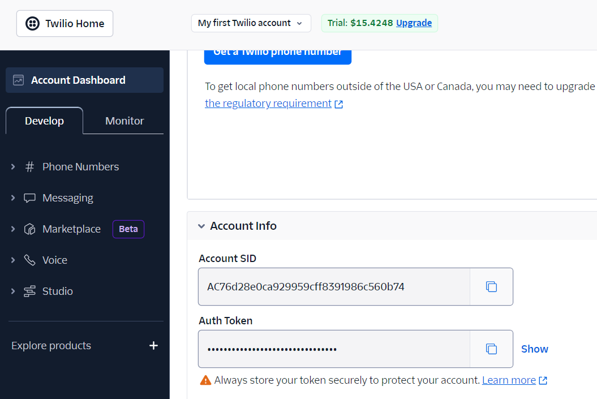
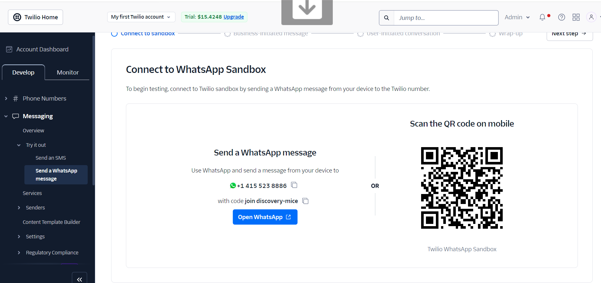
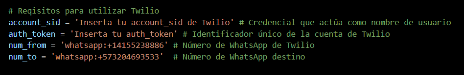

# CoinGecko
Sistema de alerta de precios de criptomonedas
=====================================

Se trata de un script de Python que monitorea los precios de tres criptomonedas (Bitcoin, Ethereum y Binance Coin) y envía una alerta de WhatsApp cuando sus precios superan ciertos umbrales.

Infomación General
---------------
* En el proyecto se utlizo la librería `requests`: Es una biblioteca que permite realizar solicitudes HTTP de manera simple y amigable. Con requests, puedes enviar solicitudes GET, POST, PUT, DELETE, entre otras, a servidores web para interactuar con APIs, descargar datos o enviar información. 

* Se realizó solicitud HTTP [`CoinGecko`](https://docs.coingecko.com/reference/introduction) que es una plataforma  de análisis de datos y precios de criptomonedas. [](https://www.ejemplo.com)

* [`twilio`](https://console.twilio.com/) Es una plataforma de comunicación en la nube que permite a desarrolladores integrar servicios de comunicación como llamadas telefónicas, mensajes de texto (SMS), WhatsApp, y más, dentro de aplicaciones web o móviles


Requerimientos
---------------

* `requests` Librería de para realiza solicitudes HTTP a la API CoinGecko
* [`twilio`](https://console.twilio.com/) Biblioteca twilio para enviar mensajes de WhatsApp.
* [API CoinGecko](https://api.coingecko.com/api/v3/simple/price?ids=bitcoin,ethereum,binancecoin&vs_currencies=usd") 
* Una cuenta de Twilio con un número habilitado para WhatsApp

Crear cuenta de Twilio
-----------------

Crea una cuenta en [Crear cuenta Twilio](https://login.twilio.com/u/signup?state=hKFo2SBqMWxFUzlPOXdKNl94aVQ3VDNRTkJJSFc5dUdmS0hPQaFur3VuaXZlcnNhbC1sb2dpbqN0aWTZIEFEeTZPWGp1RmhpY1psWUNGV1Y4dW50UXliXzIzUDFSo2NpZNkgTW05M1lTTDVSclpmNzdobUlKZFI3QktZYjZPOXV1cks) para poder obtener 
* account sid
* authtoken 



#### Conectarse a WhatsApp Sandbox
Para comenzar a probar, conéctese al sandbox de Twilio enviando un mensaje de WhatsApp desde su dispositivo al número de Twilio.


## twilio-python

### Documentación

La documentación para la API de Twilio se puede encontrar [aquí](https://www.twilio.com/docs).


### Versiones

`twilio-python` usa una versión modificada de [Versionado Semántico](https://semver.org) para todos los cambios. [Mira este documento](VERSIONS.md) para más detalles.

### Versiones de Python Soportadas

Esta librería soporta las siguientes implementaciones de Python:

- Python 3.7
- Python 3.8
- Python 3.9
- Python 3.10
- Python 3.11

### Instalación

Instala desde PyPi usando [pip](https://pip.pypa.io/en/latest/), un
administrador de paquetes para Python.

```shell
pip3 install twilio
```

Si la instalación con pip falla en Windows, revisa la longitud de la ruta del directorio. Si es mayor a 260 caracteres, habilita [Long Paths](https://docs.microsoft.com/en-us/windows/win32/fileio/maximum-file-path-limitation) o elige otra ubicación más corta.

¿No tienes pip instalado? Intenta instalarlo ejecutando esto desde la línea de comandos:

```shell
curl https://bootstrap.pypa.io/get-pip.py | python
```

O, puedes [descargar el código fuente
(ZIP)](https://github.com/twilio/twilio-python/zipball/main 'código fuente de twilio-python'), y luego ejecutar:

```shell
python3 setup.py install
```

> **Info**
> Si la línea de comandos te da un mensaje de error que dice "Permiso Denegado", intenta ejecutar los comandos anteriores con `sudo` (por ejemplo, `sudo pip3 install twilio`).

### Prueba tu instalación

Intenta enviarte un mensaje WhatsApp. Guarda el siguiente código de ejemplo en tu computadora con un editor de texto. Asegúrate de actualizar el `account_sid`, `auth_token`, y el número de teléfono `from_` con valores de tu [cuenta de Twilio](https://console.twilio.com). El número de teléfono `to` será tu propio número móvil.

```python
from twilio.rest import Client

# Reqisitos para utilizar Twilio 
account_sid = 'Inserta tu account_sid de Twilio' # Credencial que actúa como nombre de usuario
auth_token = 'Inserta tu auth_token' # Identificador único de la cuenta de Twilio
num_from = 'whatsapp:+14155238886' # Número de WhatsApp de Twilio
num_to = 'whatsapp:+573204693533'  # Número de WhatsApp destino

# Se inicia la cuenta de Twilio con la credenciales
client = Client(account_sid, auth_token)

# Se realiza el envio de la notificación 
message = client.messages.create(
from_=num_from, # Número de WhatsApp de Twilio
body=alert_msg,
to=num_to # Número de WhatsApp destino
)
print(message.sid)

```
Antes de ejecutar el script, debe reemplazar los siguientes marcadores de posición con sus propios valores:

* `account_sid`: El SID de tu cuenta Twilio
* `auth_token`: Tu token de autenticación de Twilio
* `num_from`: Tu número habilitado para Twilio WhatsApp
* `num_to`: El número de WhatsApp sobre el que deseas recibir alertas


Guarda el archivo como `send_sms.py`. En la terminal, usa `cd` para cambiar al directorio que contiene el archivo que acabas de guardar y luego ejecuta:

```shell
python3 send_sms.py
```

Después de una breve demora, recibirás el mensaje de texto en tu teléfono.

> **Advertencia**
> Está bien codificar tus credenciales de manera local para pruebas, pero deberías usar variables de entorno para mantenerlas en secreto antes de comprometer cualquier código o desplegar en producción. Consulta [Cómo configurar variables de entorno](https://www.twilio.com/blog/2017/01/how-to-set-environment-variables.html) para más información.

## Apreciaciones para ejecutar el script

En el script encontraras el siguiente código


Debes configurar el código con las credenciales dadas al momento de crear tu cuenta twilio, despues de ejecutado el código te debe llegar un mensaje al número configurado de WhatsApp.


